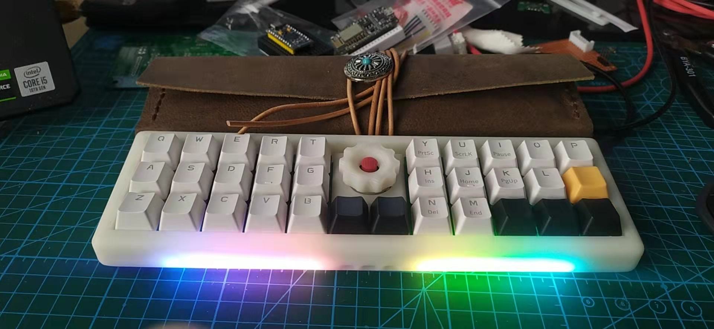
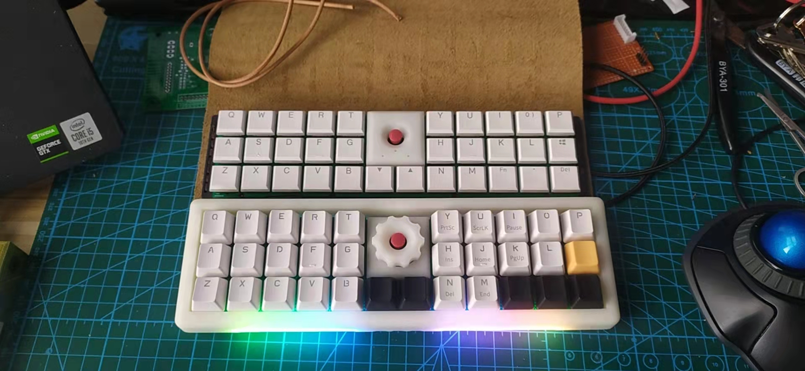
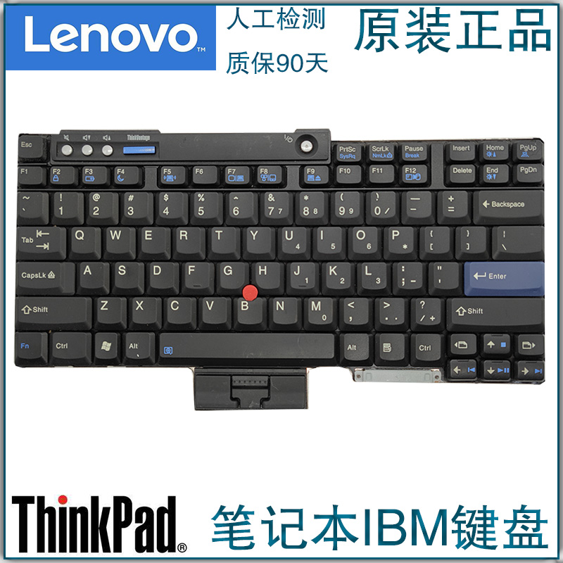
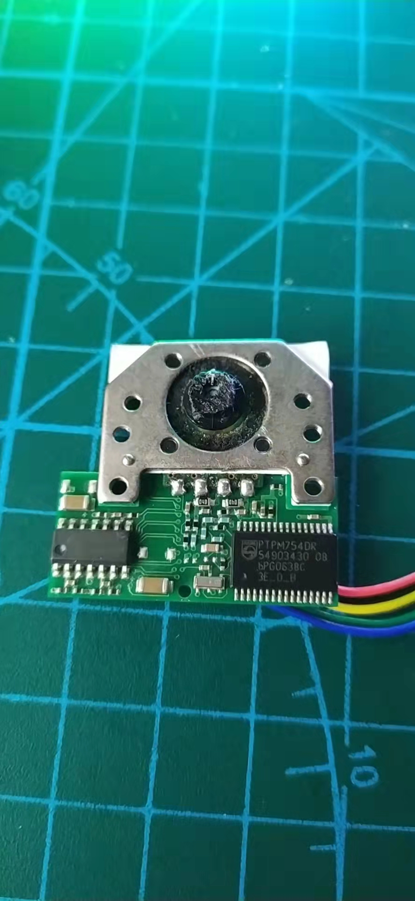
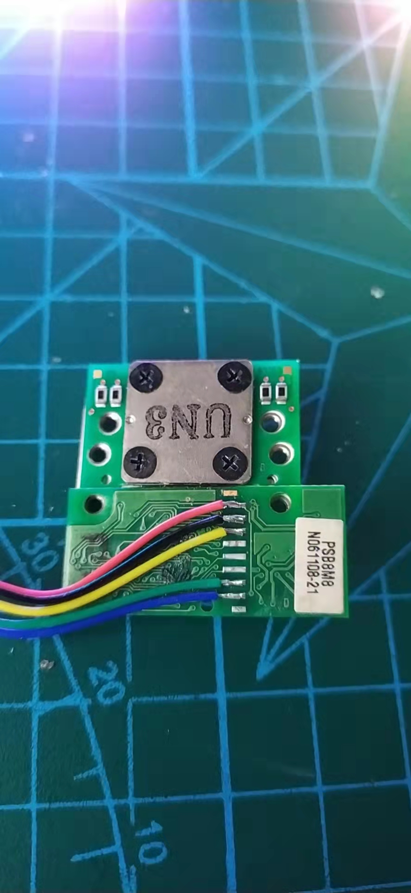
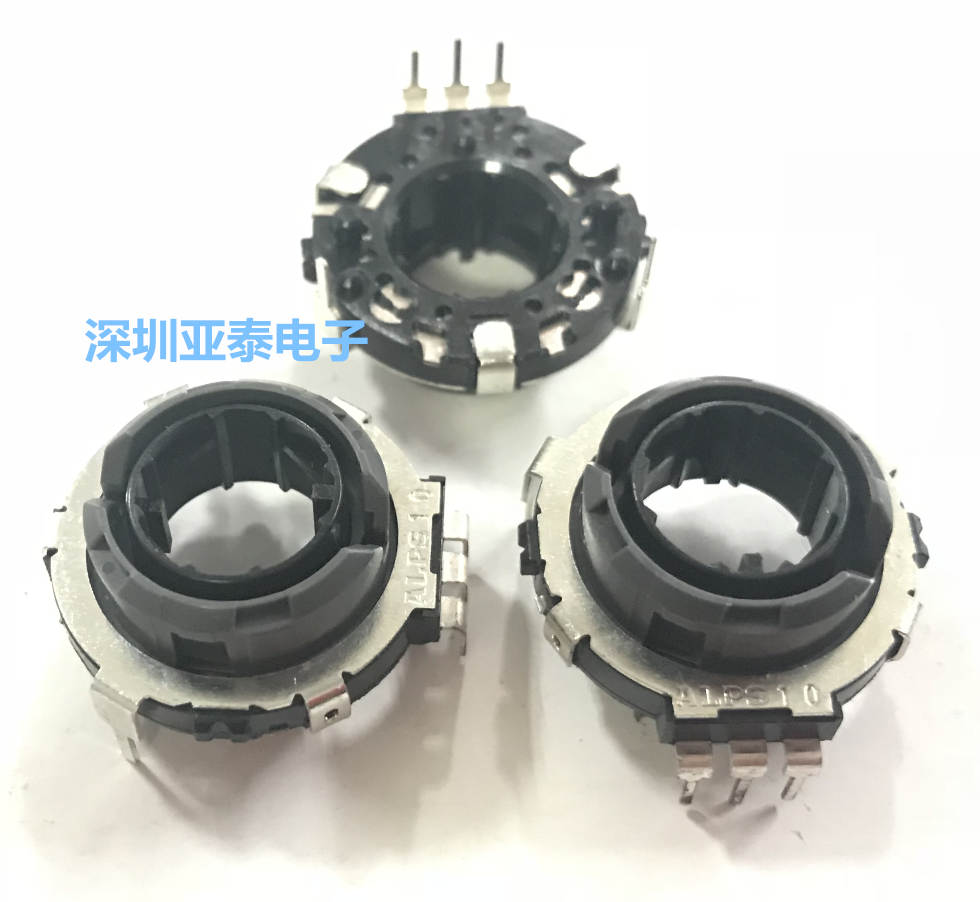
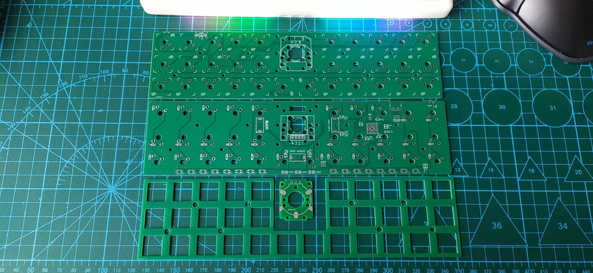

# TpEC32
## TpEC32 keyboard with running QMK

---

### IMG
[images](img/)

### TrackPoint

for thinkpad t400 r400 t500 r500 .......

line    | pad
--------|----------
red     | vcc
black   | gnd
yellow  | clk
green   | rst
blue    | data

### Encoder
encoder model is ALPS SRGP 200200

### PCB

[gerber](gerber/)

[sch](sch/)

[OSHW](https://oshwhub.com/pkerr/keyboard-juk-mx-32-rev-a)

### 3D files

[stl](stl/)

[solidworks](sw/)

### qmk

[code](code/)

### bom

Part            | Value     | Quantity
----------------|-----------|-----------
atmega32u4      | mu        | 1
trackpoint      |           | 1
srgp 200200     |           | 1
encoder pcb     |           | 1
ws2812b         | 3528      | 16
1n4148          |           | 32
mx              |           | 32
usb-c           | 16p       | 1
max 1.25        | smd       | 3
crystal 3213    | 16Mhz     | 1
c 0603          | 0.1u      | 12
c 0603          | 1u        | 5
r 0603          | 22        | 2
r 0603          | 1k        | 3
r 0603          | 4k7       | 2
r 0603          | 5k1       | 2
r 0603          | 10k       | 5

